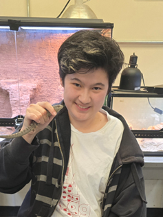
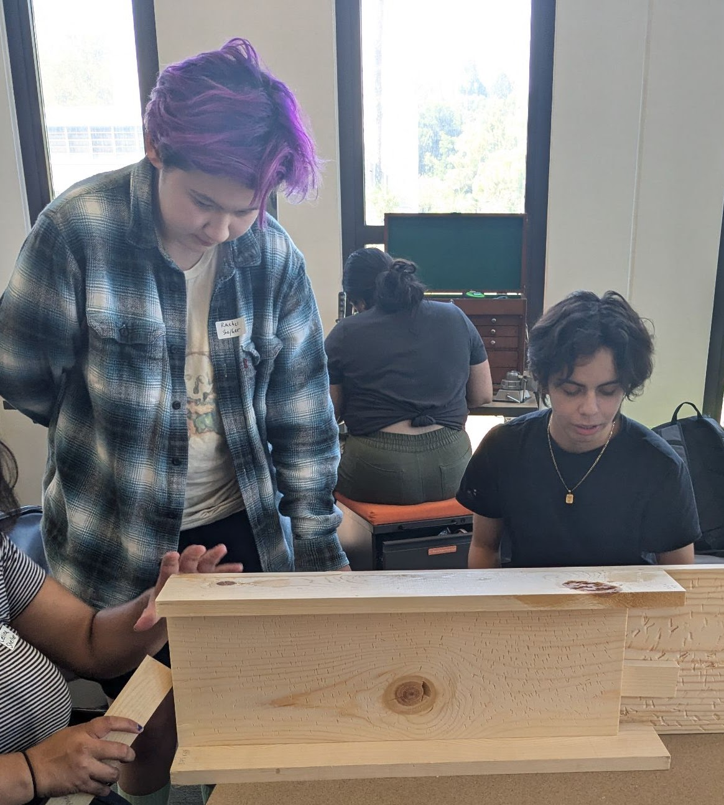

# Jobs/Volunteering {style="text-align: center"}

I am currently a TA for BIO2350, Human Physiology.\
In the past I have taught BIO1150L, Basic Biology, and Bio1220L, Foundations of Biology: Ecology, Evolution, and Biodiversity.\
I was previously a grader for BIO3250, Principles of Ecology.

Current Animal Care Volunteer at the CPP Vivarium, and Animal Keeper Volunteer at the OC Zoo.

{style=".caption{    text-align: center; }" fig-align="center" width="219"}

# Clubs {style="text-align: center"}

### Bat Night! {style="text-align: center"}

Bat Night is the semi-annual event hosted by the Bat Advocacy and Tracking Society! I have been involved since the very first Bat Night in Fall 2023. We teach the public about bats, and why it is important to conserve them. Fall Bat Week 2023 also started the ongoing bat box project, and I assisted in constructing the first sets of bat boxes.

{style=".caption{    text-align: center; }" fig-align="center" width="288"}

### Roles: {style="text-align: center"}

Former Treasurer, and founding member of the [Bat Advocacy and Tracking Society](https://www.instagram.com/b.a.t.s_cpp/). I helped secure the TGIF grant to fund the bat box project!

Former Fundraising Chair, then President of the [Zoologists of Cal Poly Pomona](https://www.instagram.com/zooclubcpp/).

Former Secretary and Co-Historian of [CPP's Nikkei Student Union](https://www.instagram.com/cppnsu/).
