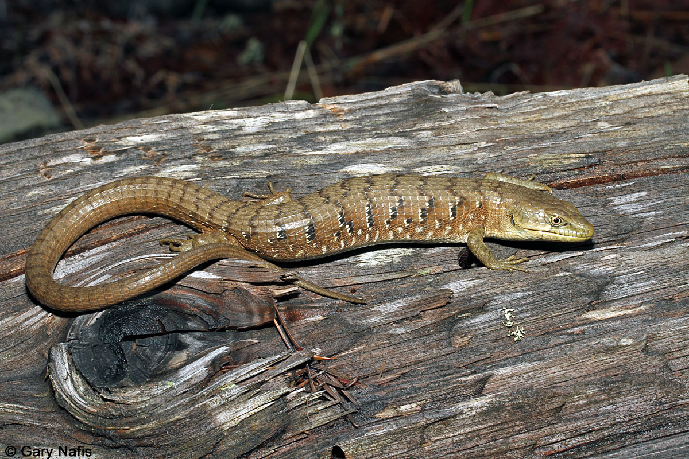

### What are Elgaria? {style="text-align: center"}

#### [Elgaria Story Map](https://storymaps.arcgis.com/stories/31e8198a587d44089ffc98d8240c5f02) {.center}

(Made during my Spring 2026 GIS Class)

Elgaria are a genus of New World lizards within the family Anguidae. They are in the subfamily Gerrhonotinae, and related to other genera of Alligator lizard.They are more distantly related to the subfamily Anguinae, a group of legless lizards commonly called glass lizards or slow worms.

My particular species of interest is *Elgaria multicarinata*, the Southern Alligator Lizard. This is the only species of Elgaria native to Los Angeles County, and the second most common urban lizard in the area, behind the Western Fence Lizard, *Sceloporus Occidentalis.*

[{style=".caption{    text-align: center; }" fig-align="center" width="466"}](https://californiaherps.com/lizards/pages/e.multicarinata.html)

Elgaria multicarinata, photo credits to Gary Nafis of CalHerps

### My Thesis Research {style="text-align: center"}

I am researching Southern Alligator Lizard bite force at different temperatures. I use an incubator, fridge (yes, a regular fridge), and rooms of various temperatures to alter the lizards' internal body temperature. These lizards are capable of activity at temperatures between 4-34 C (Roughly 39-93 F), so I am collecting data at as many temperatures across this range as I am able. I get them to bite a force transducer so the variables can be recorded. More info to come, as I am still in the process of collecting data.

{style=".caption{    text-align: center; }" fig-align="center" width="486"}

Alligator Lizard Biting

### Why is this Relevant? {style="text-align: center"}

As climate change continues, it is clear there will be some affect on ectotherms who rely on the environment to set their internal temperature. As a species that prefers a body temperature around 25-30 C (Roughly 75-84 F), how will their range or behavior shift? They use their strong bite during their mating behavior, as well as in prey capture and predator deterrence (as I have experienced). At what temperature is their optimal biting performance, and does it correlate to their preferred body temperature?

### Other Research {style="text-align: center"}

I am analyzing a Maximum Entropy model generated using iNaturalist location data for the Southern Alligator Lizard (*Elgaria multicarinata*) and the Northern Alligator Lizard (*Elgaria coerulea*) to compare environmental factors that influence their habitat partitioning.

### Other Academics {style="text-align: center"}

I'm currently taking a Scientific Writing and Advanced R class.
